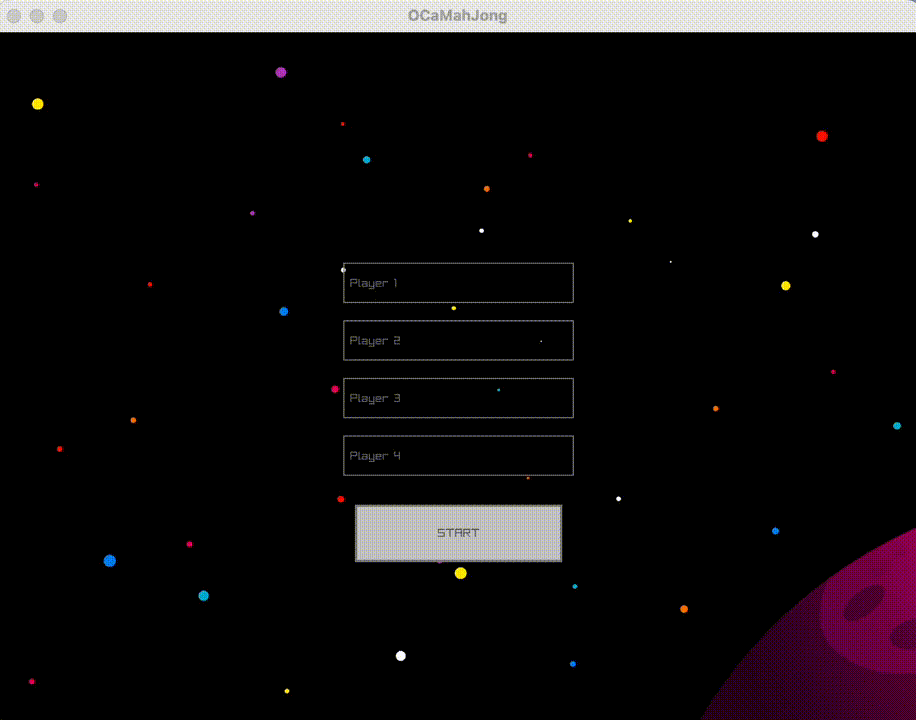
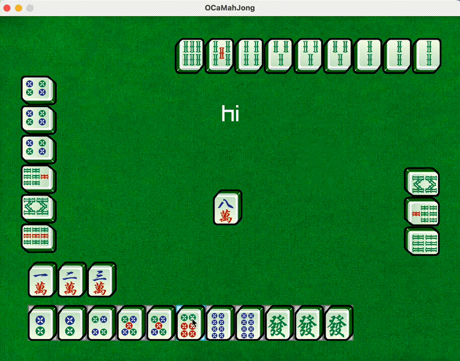
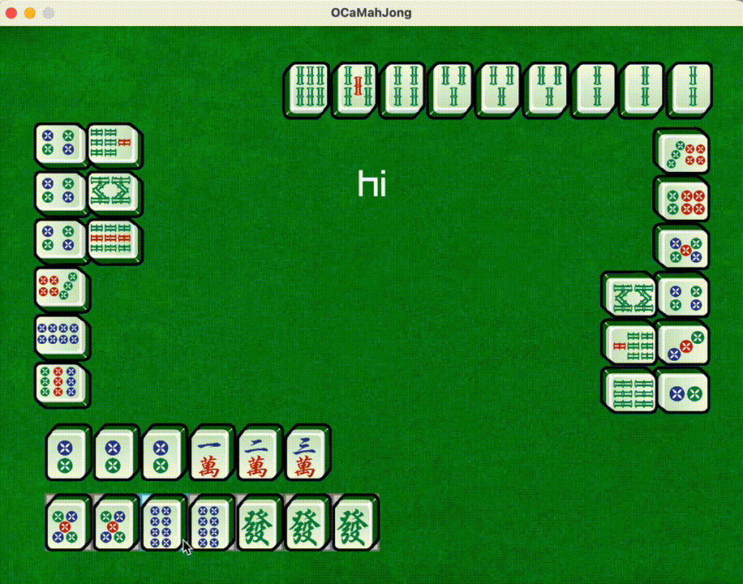

# Mahjong

## CS 3110: Data Structures and Functional Programming (OCaml) - Cornell University
Created by: Caedy Lee, Elinor Tu, Jess Wang, Albert Li

## Summary:
This project implements a digital version of Mahjong with a focus on core gameplay mechanics and system logic. The application supports player name customization, tile actions (Draw, Peng, Chi), discarded tile and exposed tiles display, and a winning algorithm with reset functionality. 

_Note: in accordance with Cornell University's Academic Integrity Policy, we are unable to show any of our code._

## Graphical User Interface

**Functionality**:
- Player name customization
  

- Player actions: Draw, Peng, Chi
- Exposed hands display
  

  
- Winning algorithm implementation for determining game outcomes and game reset functionality
  

